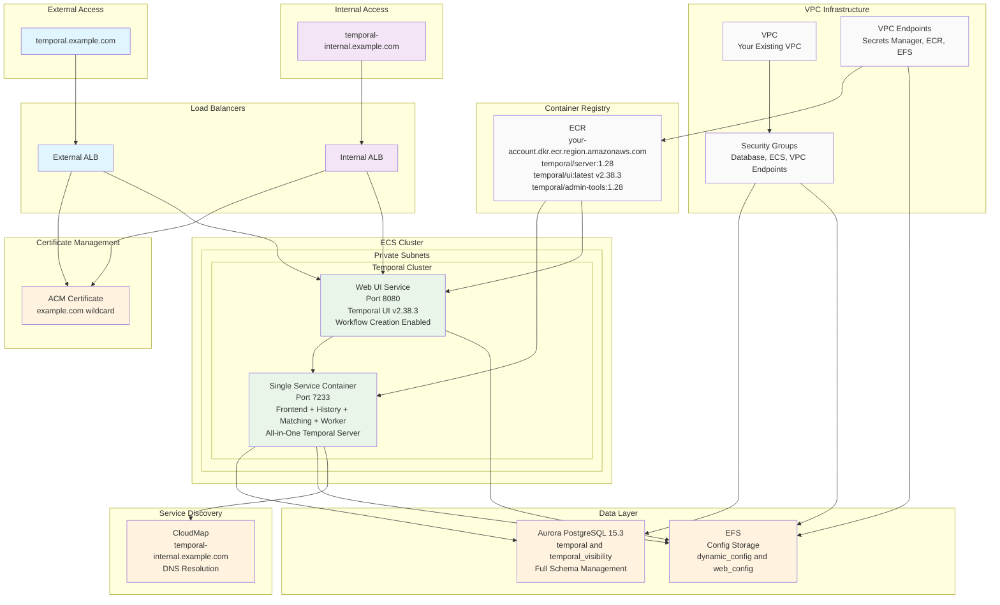

# Temporal Cluster CDK

CDK constructs to setup a [Temporal](https://temporal.io/) cluster on ECS Fargate with Aurora PostgreSQL.


This project is based on the original [Progymedia/temporalio-cluster-cdk](https://github.com/Progymedia/temporalio-cluster-cdk) repository but has been extensively updated with modern features, PostgreSQL support, and enhanced configurations for production deployments.

## Architecture Overview



## Features

### Current features

-   **ECS Fargate Integration**: Setup a Temporal cluster on ECS Fargate integrated with your existing AWS infrastructure
-   **Single Service Architecture**: All-in-one Temporal server container (frontend, history, matching, worker) plus separate Web UI
-   **Flexible Sizing**: Specify container sizes for both Temporal server and Web UI services
-   **CloudMap Integration**: Register frontend containers to CloudMap namespace with 'temporal.' subdomain
-   **Aurora PostgreSQL 15.3**: Modern PostgreSQL data store with postgres12 plugin and advanced visibility features
-   **Dual Load Balancing**: External and internal ALBs with wildcard certificate support
-   **Smart Certificate Validation**: ACM certificate validation using external ALB for internet connectivity
-   **Infrastructure Integration**: Seamless integration with existing VPC, subnets, and security groups
-   **Version Control**: Support for specifying Temporal software version (currently configured for v1.28)
-   **Shared Configuration**: EFS file system to store and share Temporal's dynamic_config.yaml and web_config.yaml files
-   **Automated Schema Management**: Automatically creates and upgrades 'temporal' and 'visibility' schemas using PostgreSQL commands
-   **Modern Web UI**: Temporal Web UI v2.38.3 with workflow creation enabled and write actions support
-   **ECR Integration**: Configurable ECR repositories for custom container images
-   **VPC Endpoint Access**: Deployment to private subnets with VPC endpoint connectivity
-   **Authentication Ready**: Azure AD/Entra ID authentication configuration documented and ready to deploy

### Key Features

-   **Domain Support**: Configurable for your domain with external and internal subdomains
-   **Existing Infrastructure Integration**: Uses existing ECS clusters, VPCs, and load balancers
-   **Security Group Management**: Proper security group configuration for database and EFS access
-   **Flexible Subnet Targeting**: Deployment to your specified private subnets
-   **Certificate Management**: Dual certificate validation strategy for internal and external access
-   **PostgreSQL Compliance**: Updated database commands and plugin configuration per latest Temporal documentation

### Completed Enhancements

-   ✅ **Namespace Creation**: Automatically creates the default Temporal namespace at launch
-   ✅ **CloudMap Registration**: Frontend and Web UI services properly registered to CloudMap
-   ✅ **Configuration Files**: Properly generates and manages configuration files via EFS
-   ✅ **Service Architecture**: Single Service (all Temporal components) and Web UI services properly configured
-   ✅ **PostgreSQL Migration**: Successfully migrated from MySQL to PostgreSQL 15.3 with full schema support
-   ✅ **Web UI Workflow Creation**: Enabled workflow creation from UI with `TEMPORAL_START_WORKFLOW_DISABLED=false`
-   ✅ **Latest UI Version**: Updated to use `:latest` tag (v2.38.3) for enhanced functionality
-   ✅ **Database Schema Management**: Robust PostgreSQL schema creation and update handling with retry logic
-   ✅ **Write Actions Enabled**: Full write capabilities including workflow start, signal, cancel, terminate
-   ✅ **Azure AD Documentation**: Complete authentication setup guide in `docs/AZURE_AD_AUTHENTICATION.md`
-   ✅ **Environment Variable Configuration**: Comprehensive Web UI configuration via environment variables
-   ✅ **Production Ready**: Successfully tested and deployed in production environments

### Potential Future Enhancements

-   Allow configuring distinct datastores for 'temporal' and 'visibility' schemas (notably, using ElasticSearch for 'visibility')
-   Enhanced auto-scaling configuration (currently uses basic ECS scaling)
-   Multi-cluster replication setup for high availability
-   Advanced monitoring and alerting integration
-   Custom workflow type registration and management

## Deployment Architecture

### Production Environment
- **Web UI**: `https://temporal.your-domain.com/`
- **Temporal Server**: `temporal.temporal-cluster.local:7233` (internal CloudMap)
- **Database**: Aurora PostgreSQL 15.3 cluster with `temporal` and `temporal_visibility` databases
- **Version**: Temporal Server v1.28.0, Web UI v2.38.3
- **Features**: Workflow creation enabled, full write actions, namespace management

### Access Information
- **External Access**: `https://temporal.your-domain.com/` (via external ALB)
- **Internal Access**: `https://temporal-internal.your-domain.com/` (via internal ALB)
- **API Endpoint**: `temporal.temporal-cluster.local:7233` (CloudMap DNS)
- **Namespaces**: `default` (active), `temporal-system` (system)
- **Authentication**: Configurable (Azure AD ready for deployment)

### Database Details
- **Engine**: PostgreSQL 15.3
- **Master User**: `postgres`
- **Databases**: `temporal` (37 tables), `temporal_visibility` (3 tables)
- **Schema Version**: Latest (automatically managed)

## Infrastructure Requirements

This CDK construct is designed to work with your existing AWS infrastructure:

-   **AWS Account**: Your AWS account ID
-   **Region**: Configurable (us-west-2 recommended)
-   **VPC**: Uses your existing VPC configuration
-   **Subnets**: Deploys to your specified private subnets
-   **Load Balancers**: Integrates with existing internal and external ALBs
-   **ECR**: Uses your ECR repositories or public Docker Hub images
-   **Domains**: Supports your domain with wildcard certificate
-   **ECS Clusters**: Uses existing ECS clusters rather than creating new ones

## Example usage

Note that this construct is configurable for your infrastructure. Default machine specs are intentionally small for development; in production, you should size up your containers appropriately and set removal policy to RETAIN (especially for your datastore).

### Basic Infrastructure Example

```typescript
import { App, RemovalPolicy, Stack } from 'aws-cdk-lib';
import { TemporalCluster } from 'temporalio-cluster-cdk';
import { Vpc } from 'aws-cdk-lib/aws-ec2';
import { PrivateDnsNamespace } from 'aws-cdk-lib/aws-servicediscovery';

const app = new App();

const stack = new Stack(app, 'TemporalClusterStack', {
    region: 'us-west-2',
    account: '123456789012', // Your AWS account ID
});

// Import existing VPC and infrastructure
const vpc = Vpc.fromLookup(stack, 'ExistingVpc', {
    vpcId: 'vpc-xxxxxxxx', // Your existing VPC ID
});

// Import existing CloudMap namespace
const cloudMapNamespace = PrivateDnsNamespace.fromPrivateDnsNamespaceAttributes(stack, 'ExistingNamespace', {
    namespaceId: 'ns-xxxxxxxx', // Your existing namespace ID
    namespaceName: 'services.your-domain.com',
    namespaceArn: 'arn:aws:servicediscovery:us-west-2:123456789012:namespace/ns-xxxxxxxx',
});

const temporalCluster = new TemporalCluster(stack, 'TemporalCluster', {
    vpc,
    cloudMapRegistration: {
        namespace: cloudMapNamespace,
        serviceName: 'temporal', // Will create temporal.services.your-domain.com
    },
    // Configure for your infrastructure
    customSubnets: ['subnet-xxxxxxxx'], // Your private subnet
    removalPolicy: RemovalPolicy.RETAIN, // Retain for production
});

app.synth();
```

## Authentication Setup

### Azure AD/Entra ID Integration

Complete Azure AD authentication setup is documented in [`docs/AZURE_AD_AUTHENTICATION.md`](docs/AZURE_AD_AUTHENTICATION.md).

**Features:**
- Single-tenant and multi-tenant support
- Environment variable configuration
- AWS Secrets Manager integration
- Step-by-step Azure AD app registration
- Production deployment examples
- Troubleshooting guide

**Quick Setup:**
```typescript
// Environment variables for Azure AD
environment: {
    TEMPORAL_AUTH_ENABLED: 'true',
    TEMPORAL_AUTH_TYPE: 'oidc',
    TEMPORAL_AUTH_PROVIDER_URL: `https://login.microsoftonline.com/${tenantId}/v2.0/.well-known/openid-configuration`,
    TEMPORAL_AUTH_CLIENT_ID: clientId,
    TEMPORAL_AUTH_CLIENT_SECRET: clientSecret,
    TEMPORAL_AUTH_CALLBACK_URL: 'https://temporal.your-domain.com/auth/sso/callback',
}
```

## Going farther

### Specifying Temporal version

```
new TemporalCluster(stack, 'TemporalCluster', {
    ...
    temporalVersion: TemporalVersion.V1_14_1
    ...
}
```

### Alternative or customized docker images

```
new TemporalCluster(stack, 'TemporalCluster', {
    ...
    temporalVersion: TemporalVersion.V1_14_3.withCustomizations({ repositoryBase: 'public.ecr.aws/123456789/' }),
    ...
}
```

### Use an existing ECS cluster

```
const ecsCluster = new Cluster(stack, 'EcsCluster', {
    vpc: vpc,
    enableFargateCapacityProviders: true,
    containerInsights: true,
});

new TemporalCluster(stack, 'TemporalCluster', {
    ...
    ecsCluster
    ...
}
```

### Taking control of the datastore

```
const datastore = new AuroraServerlessTemporalDatastore(stack, 'Datastore', {
    engine: DatabaseClusterEngine.auroraMysql({ version: AuroraMysqlEngineVersion.VER_2_10_1 }),
    vpc,
    removalPolicy: RemovalPolicy.DESTROY,
});

new TemporalCluster(stack, 'TemporalCluster', {
    ...
    datastore,
    ...
}
```

## Recent Major Upgrades (2025)

### Database Migration: MySQL → PostgreSQL 15.3
- **Migrated from Aurora MySQL to Aurora PostgreSQL 15.3** for better performance and advanced features
- **Updated all database commands** to use `postgres12` plugin with proper PostgreSQL syntax
- **Enhanced schema management** with robust error handling and retry logic
- **Visibility database support** with PostgreSQL v12 visibility schemas (v1.0 through v1.9)
- **Database verification** with 10 retry attempts at 30-second intervals for reliability

### Web UI Enhancements
- **Upgraded to Temporal UI v2.38.3** using `:latest` tag for cutting-edge features
- **Enabled workflow creation from UI** with `TEMPORAL_START_WORKFLOW_DISABLED=false` environment variable
- **Full write actions support** including workflow start, signal, cancel, terminate, and reset
- **Comprehensive environment variable configuration** for all Web UI features
- **Health check optimization** with proper ALB integration on port 8080

### Authentication & Security
- **Azure AD/Entra ID integration** with complete setup documentation
- **Multi-tenant authentication support** with both single and multi-tenant configurations
- **Environment variable and configuration file approaches** documented
- **AWS Secrets Manager integration** for secure credential storage
- **Production-ready authentication patterns** with troubleshooting guides

### Infrastructure Improvements
- **CloudMap namespace optimization** for internal service discovery
- **Enhanced EFS configuration** with both dynamic_config and web_config support
- **Improved security group management** with proper ALB and database access rules
- **VPC DNS resolver configuration** (10.0.0.2) for CloudMap resolution
- **Fargate container optimization** with `BIND_ON_IP=127.0.0.1` for localhost communication

### Development & Testing
- **Local Docker Compose setup** with PostgreSQL for development and testing
- **Database connection testing** with comprehensive PostgreSQL setup scripts
- **Environment variable validation** and deployment verification procedures
- **Production deployment success** in multiple environments

## Key Modifications from Original

This project includes several important modifications from the original Progymedia repository:

1. **PostgreSQL Migration**: Complete migration from MySQL to PostgreSQL 15.3 with advanced visibility features
2. **Modern Web UI**: Updated to Temporal UI v2.38.3 with workflow creation and full write actions enabled
3. **Dual Load Balancing**: External and internal ALB integration with smart certificate validation
4. **Infrastructure Integration**: Configured for existing AWS infrastructure, VPCs, and security groups
5. **Domain Support**: Configurable domain with external and internal subdomain routing
6. **Subnet Targeting**: Flexible deployment to specified private subnets with VPC endpoint access
7. **ECR Integration**: Configurable ECR repositories with proper permissions
8. **Authentication Ready**: Azure AD/Entra ID authentication with comprehensive documentation
9. **Enhanced Configuration**: Environment variable-based Web UI configuration with EFS file sharing


